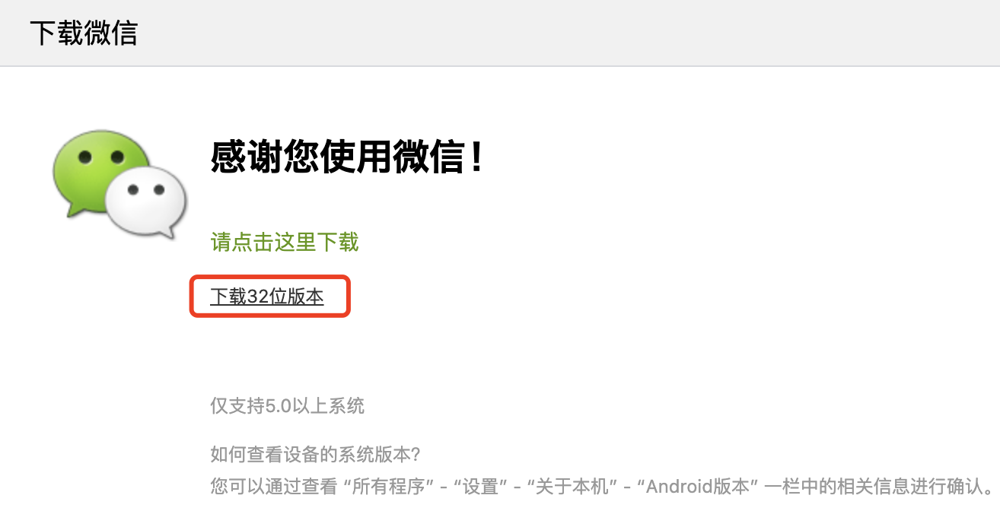
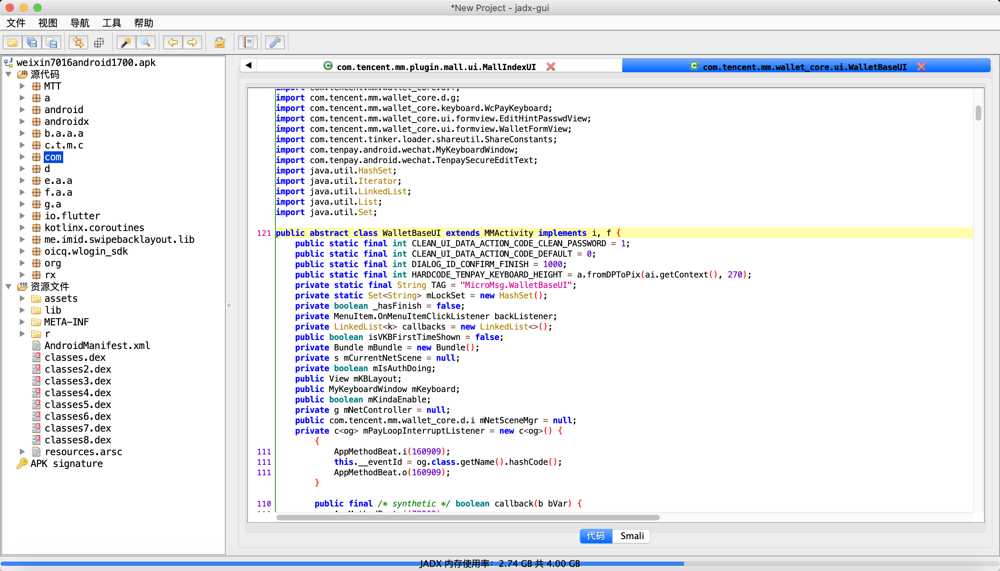
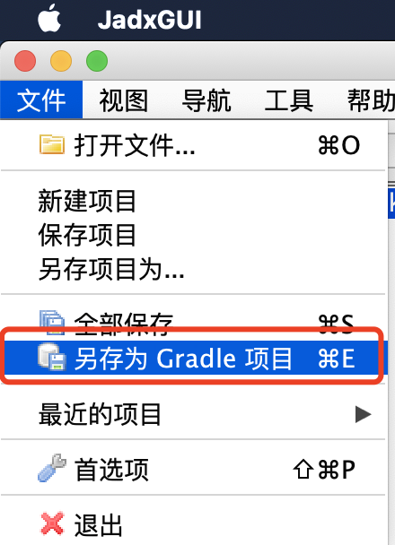
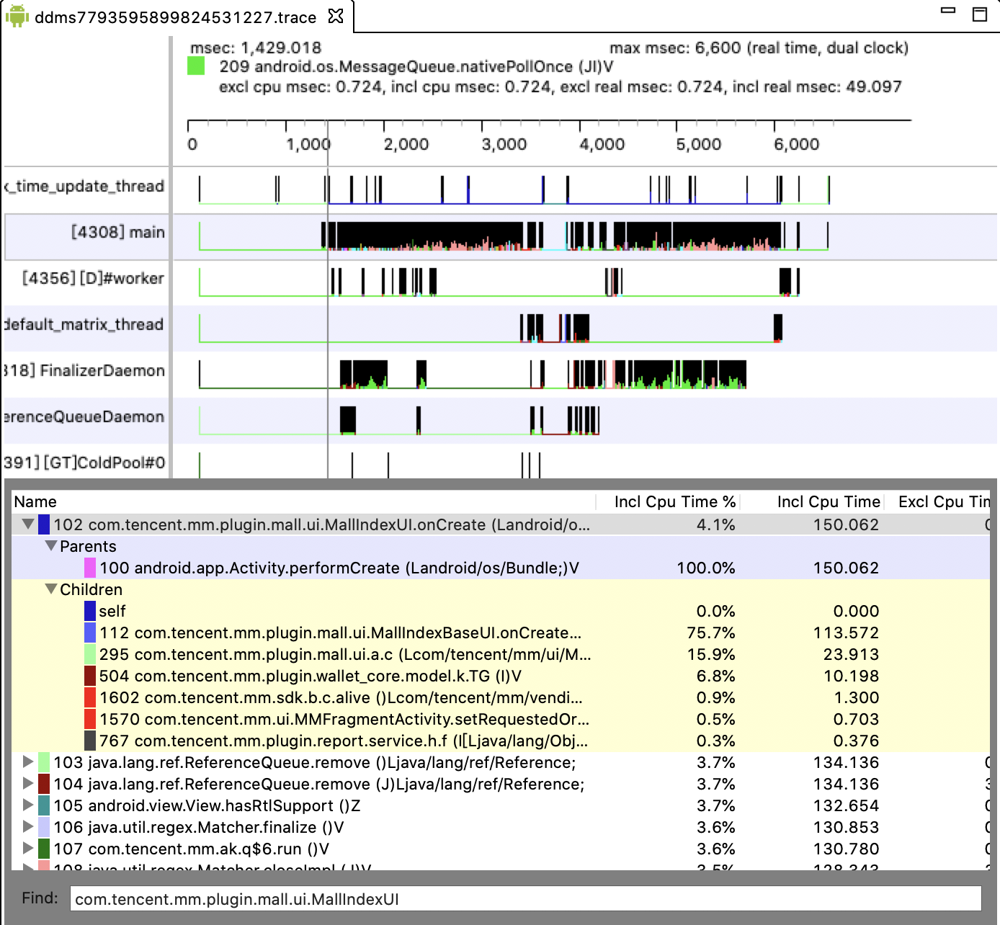
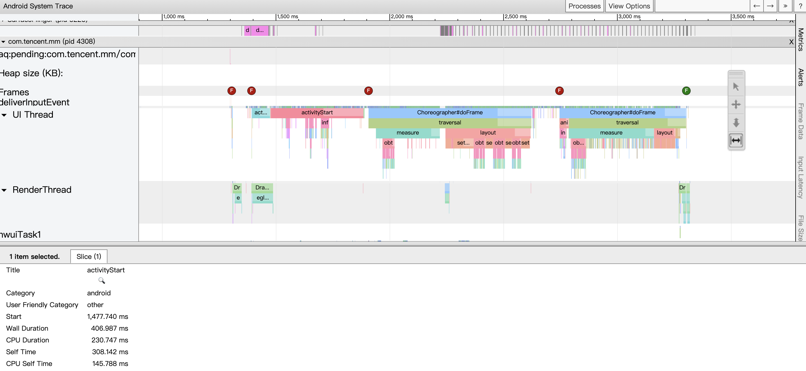
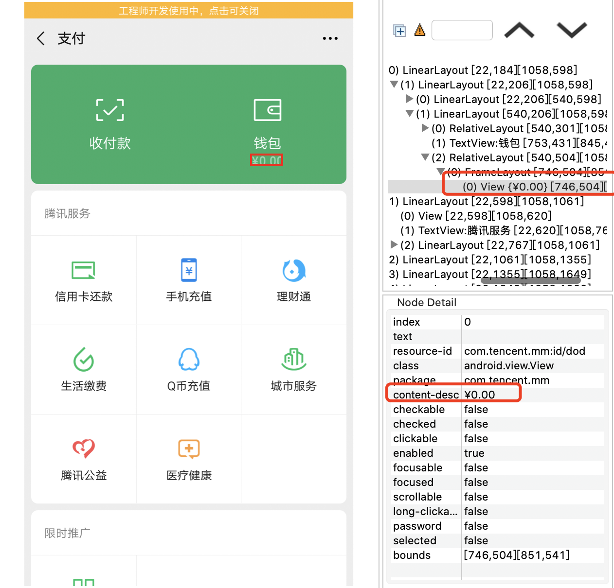
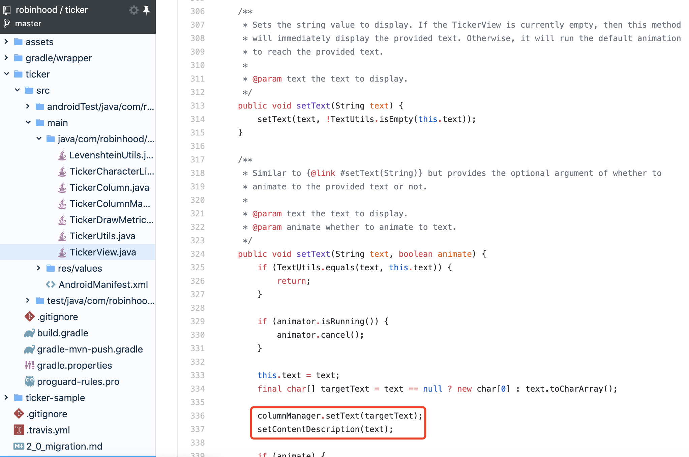

# Xposed系列之微信装X指南(二)

## 需求
比如说每个人都有一个小目标，每天看看自己的目标会更有动力，比如每天看着微信余额几毛钱几块钱
仅为学习娱乐，分享下如何通过Xposed让自己的资产看起来实现了小目标
首先设定下目标，支付页面，钱包页面，零钱页面

## 结果

## 准备工作
### Root相关
- [TWRP Recovery](https://twrp.me/)：一款强大的第三方recovery，有着官方Recovery无法做到的功能，安装Magisk Manager需要用到
- [Magisk Manager](https://magiskmanager.com/)：一款强大的刷Root工具，可以替代替代`SuperSU`进行root权限管理

如果用VirtualXposed或太极或其他虚拟环境的Xposed则可以不用Root，如果用Xposed Installer则需要Root权限，
关于这三者可看上篇文章：[Xposed系列之Demo上手指南及源码解析(一)](https://github.com/xbdcc/CXposed/blob/master/demo/README.md)

### 反编译相关
- [apktool](https://github.com/iBotPeaches/Apktool)：主要用于反编译APK查看资源文件
- [dex2jar](https://github.com/pxb1988/dex2jar)：反编译APK得到Java源代码Jar包
- [jd-gui](http://java-decompiler.github.io/)：一般配合`dex2jar`使用，将其反编译得到的jar包拖进gui方便查看源码
- [jadx](https://github.com/skylot/jadx)：功能强大的反编译工具，可以直接查看Java代码和资源文件等，同时支持查看Smali

推荐使用jadx工具反编译，如从微信官网下载的[32位版本微信](https://dldir1.qq.com/weixin/android/weixin7016android1700.apk)，默认都是会下载上面[`weixin7016android1700_arm64.apk`](https://dldir1.qq.com/weixin/android/weixin7016android1700_arm64.apk)，
如果下载arm64版本则有些x86架构的模拟器不支持微信就不能正常使用了，所以用32位主要是为了方便在模拟器上调试

然后将下载下来的[`weixin7016android1700.apk`](https://dldir1.qq.com/weixin/android/weixin7016android1700.apk)拖入JadxGUI中，反编译结果如下图：

并且我们还可以另存为Gradle项目，在Android Studio或IDEA中查看，操作入口如下：


### Hook分析相关
- adb命令：
- monitor：

#### adb命令
adb 命令可以参考https://github.com/xbdcc/CCommand， 这里简单介绍这里需要使用的：
```
adb shell dumpsys activity top > activity_top.txt
```
当然如果adb命令你已经很熟悉了想快捷输入也可以在环境变量中设置`alisa`，
- 控制台中输入`vim ~/.bash_profile`
- 在其中加入一行设置`adb shell dumpsys activity top > activity_top.txt`的别名为`activity_top`，如下：
```
alias activity_top="adb shell dumpsys activity top > activity_top.txt"
```
- 然后按`esc`键，再输入`:wq`回车退出并保存
- 再输入`source ~/.bash_profile`使环境变量生效
- 最后控制台直接输入`activity_top`回车就和刚刚一长串命令一样的效果了

该命令可以输出当前Activity信息，如命令抓取的零钱页面Activity的信息如下：
```
TASK com.tencent.mm id=184
  ACTIVITY com.tencent.mm/.plugin.wallet.balance.ui.WalletBalanceManagerUI 1fcb6708 pid=1326
    Local Activity 27bbdf64 State:
      mResumed=true mStopped=false mFinished=false
      mLoadersStarted=true
      mChangingConfigurations=false
      mCurrentConfig={1.0 ?mcc?mnc zh_CN ?layoutDir sw360dp w360dp h622dp 480dpi nrml long port finger -keyb/v/h -nav/h s.5mThemeChanged = 0mThemeChangedFlags = 0mFlipFont = 0}
    Active Fragments in 247455f2:
      #0: ReportFragment{22e48443 #0 android.arch.lifecycle.LifecycleDispatcher.report_fragment_tag}
        mFragmentId=#0 mContainerId=#0 mTag=android.arch.lifecycle.LifecycleDispatcher.report_fragment_tag
        mState=5 mIndex=0 mWho=android:fragment:0 mBackStackNesting=0
        mAdded=true mRemoving=false mResumed=true mFromLayout=false mInLayout=false
        mHidden=false mDetached=false mMenuVisible=true mHasMenu=false
        mRetainInstance=false mRetaining=false mUserVisibleHint=true
        mFragmentManager=FragmentManager{247455f2 in WalletBalanceManagerUI{27bbdf64}}
        mActivity=com.tencent.mm.plugin.wallet.balance.ui.WalletBalanceManagerUI@27bbdf64
        Child FragmentManager{a6aeac0 in ReportFragment{22e48443}}:
          FragmentManager misc state:
            mActivity=com.tencent.mm.plugin.wallet.balance.ui.WalletBalanceManagerUI@27bbdf64
            mContainer=android.app.Fragment$1@138ca3f9
            mParent=ReportFragment{22e48443 #0 android.arch.lifecycle.LifecycleDispatcher.report_fragment_tag}
            mCurState=5 mStateSaved=false mDestroyed=false
    Added Fragments:
      #0: ReportFragment{22e48443 #0 android.arch.lifecycle.LifecycleDispatcher.report_fragment_tag}
    FragmentManager misc state:
      mActivity=com.tencent.mm.plugin.wallet.balance.ui.WalletBalanceManagerUI@27bbdf64
      mContainer=android.app.Activity$1@386ddf3e
      mCurState=5 mStateSaved=false mDestroyed=false
    ViewRoot:
      mAdded=true mRemoved=false
      mConsumeBatchedInputScheduled=false
      mConsumeBatchedInputImmediatelyScheduled=false
      mPendingInputEventCount=0
      mProcessInputEventsScheduled=false
      mTraversalScheduled=false
      android.view.ViewRootImpl$NativePreImeInputStage: mQueueLength=0
      android.view.ViewRootImpl$ImeInputStage: mQueueLength=0
      android.view.ViewRootImpl$NativePostImeInputStage: mQueueLength=0
    Choreographer:
      mFrameScheduled=false
      mLastFrameTime=16770070 (150010 ms ago)
    View Hierarchy:
      com.android.internal.policy.impl.PhoneWindow$DecorView{162d5b8c V.ED.... R....... 0,0-1080,1920}
        com.tencent.mm.ui.widget.SwipeBackLayout{15900669 VFE..... ........ 0,0-1080,1920 #7f09245b app:id/g2s}
          com.tencent.mm.ui.statusbar.b{303be18f V.ED.... ........ 0,0-1080,1920}
            android.widget.LinearLayout{1d1aa478 V.E..... ........ 0,54-1080,1920}
              android.view.ViewStub{2f44c751 G.E..... ......I. 0,0-0,0 #1020373}
              android.widget.FrameLayout{ea9bbb6 V.E..... ........ 0,0-1080,1866}
                android.support.v7.widget.ActionBarOverlayLayout{1e0ddd42 V.E..... ........ 0,0-1080,1866 #7f090a81 app:id/b8w}
                  android.support.v7.widget.ContentFrameLayout{6698a90 V.E..... ........ 0,130-1080,1866 #1020002 android:id/content}
                    com.tencent.mm.ui.LayoutListenerView{941b6fc V.E..... ........ 0,0-1080,1736 #7f0917b0 app:id/dp5}
                      android.widget.ScrollView{cc9bba6 VFED.... ........ 0,0-1080,1736}
                        android.widget.RelativeLayout{3887e994 V.E..... ........ 0,0-1080,1736}
                          android.widget.TextView{3781bc3d G.ED.... ......I. 0,0-0,0 #7f09289c app:id/guw}
                          android.widget.LinearLayout{15c40b00 V.E..... ........ 0,0-1080,1736}
                            android.widget.ImageView{1d2df39 V.ED.... ........ 453,130-626,303 #7f09034d app:id/w5}
                            android.widget.TextView{25e2997e V.ED.... ........ 448,389-632,451 #7f09259c app:id/ga5}
                            android.widget.LinearLayout{21b3eedf V.E..... ........ 0,451-1080,721}
                              android.widget.RelativeLayout{bded72c V.E..... ........ 0,43-1080,157}
                                com.tencent.mm.plugin.wallet_core.ui.view.WcPayMoneyLoadingView{b7935f5 V.E..... ........ 375,0-705,114 #7f0928aa app:id/gv_}
                                  com.robinhood.ticker.TickerView{21299fb V.ED.... ........ 0,0-330,114 #7f091794 app:id/dod}
                                android.widget.ProgressBar{1ff83a18 G.ED.... ......I. 0,0-0,0 #7f092905 app:id/gxq}
                              android.widget.LinearLayout{36ce5a56 G.E..... ......I. 0,0-0,0 #7f09033f app:id/vr}
                                android.widget.TextView{29e6dad7 V.ED.... ......ID 0,0-0,0 #7f090340 app:id/vs}
                                android.widget.ImageView{742dfc4 V.ED.... ......ID 0,0-0,0 #7f09033e app:id/vq}
                              android.widget.LinearLayout{d3f2ead G.E..... ......I. 0,0-0,0 #7f09034b app:id/w3}
                                com.tencent.mm.pluginsdk.ui.applet.CdnImageView{28544d73 V.ED.... ......I. 0,0-0,0 #7f09034a app:id/w2}
                                com.tencent.mm.wallet_core.ui.WalletTextView{35703430 V.ED.... ......ID 0,0-0,0 #7f090349 app:id/w1}
                                com.tencent.mm.pluginsdk.ui.applet.CdnImageView{3dcd08a9 V.ED.... ......I. 0,0-0,0 #7f090348 app:id/w0}
                            android.widget.Space{111c4dcf I.ED.... ......I. 0,721-1080,1101}
                            android.widget.LinearLayout{25dc635c V.E..... ........ 0,1187-1080,1295}
                              android.widget.Button{3a448665 VFED..C. ........ 291,0-788,108 #7f0919c4 app:id/e3i}
                              android.widget.Button{b7a5948 GFED..C. ......I. 0,0-0,0 #7f09289d app:id/gux}
                              android.widget.LinearLayout{363e27c7 G.E..... ......I. 0,0-0,0 #7f09141b app:id/d1c}
                                android.widget.TextView{137fc1f4 V.ED.... ......ID 0,0-0,0 #7f09141c app:id/d1d}
                                android.widget.ImageView{31361d1d G.ED.... ......I. 0,0-0,0 #7f09153c app:id/d96}
                            android.widget.LinearLayout{12576b92 V.E..... ........ 464,1554-616,1606}
                              android.widget.TextView{36eb7963 V.ED..C. ........ 0,0-152,52 #7f09289f app:id/guz}
                              android.view.View{181c6e19 G.ED.... ......I. 0,0-0,0 #7f09289e app:id/guy}
                              android.widget.TextView{2dfcaede G.ED.... ......I. 0,0-0,0 #7f09289b app:id/guv}
                            android.widget.TextView{2f9248bf V.ED.... ........ 0,1628-1080,1671 #7f092951 app:id/gzs}
                      android.widget.Button{39a3e185 GFED..C. ......ID 0,0-0,0 #7f0917c6 app:id/dpq}
                  android.support.v7.widget.ActionBarContainer{1e880f89 V.ED.... ........ 0,0-1080,130 #7f090059 app:id/bp}
                    android.support.v7.widget.Toolbar{1a08b8e V.E..... ........ 0,0-1080,130 #7f090057 app:id/bn}
                      android.widget.LinearLayout{88b4a54 V.E..... ........ 0,0-810,130 #7f09005b app:id/br}
                        android.widget.LinearLayout{24ec6dfd V.E...C. ........ 0,0-108,130 #7f0900a0 app:id/dm}
                          com.tencent.mm.ui.widget.imageview.WeImageView{10dc1af2 V.ED.... ........ 22,0-86,130 #7f0900a1 app:id/dn}
                        android.widget.LinearLayout{1e96ecf9 G.E..... ......I. 0,0-0,0 #7f090098 app:id/de}
                          com.tencent.mm.ui.widget.AlbumChooserView{40cf43e V.E...C. ......I. 0,0-0,0 #7f09008a app:id/d1}
                            android.widget.RelativeLayout{13558fec V.E..... ......I. 0,0-0,0}
                              android.widget.TextView{9d05fb5 V.ED.... ......ID 0,0-0,0 #7f090120 app:id/h3}
                              android.widget.FrameLayout{25e0164a V.E..... ......I. 0,0-0,0}
                                com.tencent.mm.ui.widget.imageview.WeImageView{2e7039bb V.ED.... ......ID 0,0-0,0 #7f09011f app:id/h2}
                        android.widget.LinearLayout{1901bed8 V.E..... ......I. 108,0-108,130 #7f0925d1 app:id/gbk}
                          android.widget.LinearLayout{20f44231 V.E..... ......ID 0,0-0,130}
                            android.widget.ImageView{17114d16 G.ED.... ......I. 0,0-0,0 #7f0925d0 app:id/gbj}
                            android.widget.TextView{cdeb697 V.ED.... ......ID 0,34-0,96 #1020014 android:id/text1}
                            android.widget.ProgressBar{263ff084 G.ED.... ......I. 0,0-0,0 #7f091c5e app:id/eki}
                          android.widget.TextView{364d24a2 G.ED.... ......I. 0,0-0,0 #1020015 android:id/text2}
                      android.support.v7.widget.ActionMenuView{c9308ac V.E..... ........ 810,0-1080,130}
                        android.widget.LinearLayout{25f3ae17 V.E..... ........ 0,0-270,130}
                          android.widget.ImageButton{24965204 GFED..C. ......I. 0,0-0,0 #7f09007c app:id/cn}
                          android.widget.TextView{141653ed V.ED..CL ........ 0,0-270,130 #7f090079 app:id/ck}
                          android.widget.LinearLayout{357b14b3 G.E..... ......I. 0,0-0,0 #7f090158 app:id/il}
                            android.widget.ImageView{3b288a70 V.ED.... ......ID 0,0-0,0}
                          android.widget.Button{d1141e9 GFED..CL ......I. 0,0-0,0 #7f090076 app:id/ch}
                          android.widget.RelativeLayout{1908490f V.E..... ......ID 270,65-270,65}
                            com.tencent.mm.ui.widget.imageview.WeImageView{3f63dd9c G.ED.... ......I. 0,0-0,0 #7f090078 app:id/cj}
                            android.widget.ImageView{2db313a5 G.ED.... ......I. 0,0-0,0 #7f090b6f app:id/beb}
                    android.support.v7.widget.ActionBarContextView{18591b45 G.E..... ......I. 0,0-0,0 #7f090065 app:id/c1}
    Looper (main, tid 1) {1f1b79df}
      Message 0: { when=+6m42s348ms what=26 target=com.tencent.mm.sdk.platformtools.ao$2 }
      Message 1: { when=+26m42s267ms what=23 target=com.tencent.mm.sdk.platformtools.ao$2 }
      (Total messages: 2, idling=false, quitting=false)
    Local FragmentActivity 27bbdf64 State:
      mCreated=true mResumed=true mStopped=false    FragmentManager misc state:
      mHost=android.support.v4.app.FragmentActivity$a@1273f2ec
      mContainer=android.support.v4.app.FragmentActivity$a@1273f2ec
      mCurState=4 mStateSaved=false mStopped=false mDestroyed=false
```

#### monitor
- 可以查看布局元素和trace信息，分析布局可以查看之前文章[Android通过辅助功能实现抢微信红包原理简单介绍
](https://www.jianshu.com/p/e1099a94b979)
- ，分析trace方法调用栈，例如下：

- ，生成生成html格式的trace，可以分析卡顿丢帧等问题，如果有打Trace也可以在上面看出来。可以在Chrome里打开查看，如下：


### 介绍三种方便查找id值的方法
假如我们要查看id为`dod`的值：

#### 通过`activity_top`查看
在里面找到元素对应的值，为十六进制值。如上面结果中有这样一行，可以看到id为'dod'的值为十六进制值`7f091794`
```
    com.robinhood.ticker.TickerView{21299fb V.ED.... ........ 0,0-330,114 #7f091794 app:id/dod}
```
#### 通过apk查看
可以把apk拖进AS中，在`resources.arsc`下选择你要找的id，得到的值为十六进制

#### 通过jadx查看
双击`resources.arsc`，可以在里面搜索id，得到的值为十进制。如id为`dod`的值为十进制值`2131302292`


## Hook分析
通过`activity_top`得知：
- 支付页面：com.tencent.mm/.plugin.mall.ui.MallIndexUI
- 钱包页面：com.tencent.mm/.plugin.mall.ui.MallWalletUI
- 零钱页面：com.tencent.mm/.plugin.wallet.balance.ui.WalletBalanceManagerUI

### 分析布局
- 首先打开支付页面我们通过monitor的`Dump View Hierarchy`，得知显示钱包的金额的控件id为`dod`

- 然后我们通过`activity_top`找到这个id的地方知道它其实是`com.robinhood.ticker.TickerView`这个控件，
嗯这个一看就是不是腾讯的自定义View而是用的第三方库，Github上一搜，可以知道它用的是[ticker](https://github.com/robinhood/ticker)这个库，
然后后面可以看到钱包页面和零钱页面显示金额的也是用的这个控件
- 知道了这个库我们可以看下TickerView这个类的代码，这里再推荐一个Chrome插件[octotree](https://www.octotree.io/)比较方便在GitHub网页上切换文件，
如下，可以看到这里有个setText方法，里面执行了`columnManager.setText(targetText);`代码，而`columnManager`最后执行了`columnManager.draw(canvas, textPaint);`把文字绘制到Canvas上了，
`setContentDescription(text);`设置了contentDescription的值，所以这就是我们能看到描述和显示金额的值一样，但是它的text属性值却为空的原因了。



### 分析支付页面MallIndexUI

- 首先我们观察到每次进入支付页面它的金额旁边是有个loading的，并且从钱包页面返回到支付页面也都会loading一下，那么可以猜想它可能是在onResume里面做了什么操作
（其实直接看它代码一下就能看出来，假设我们还没看代码先简单猜下）。那么我们看下它的onResume方法调用栈如下：


- 看到了吗？里面主要就执行了`MallIndexBaseUI`(MallIndexUI的父类）的`onResume`和自己的`dbb`方法，这个时候如果你不想看源码继续分析的话其实就已经可以尝试Hook跑起来看看效果了，
本着保险起见我们还是先继续看看它的源码
```java
    public final void dbb() {
        AppMethodBeat.i(66131);
        ac.i("MicorMsg.MallIndexUI", "updateBalanceNum");
        ak akVar = new ak();
        if (akVar.erV()) {
            this.uCo.setText((String) g.agR().agA().get(ah.a.USERINFO_WALLET_RELEAY_NAME_BALANCE_CONTENT_STRING_SYNC, (Object) getString(R.string.eex)));
            this.uCo.setVisibility(0);
            this.uDf.setVisibility(8);
            this.uDg.setVisibility(8);
            AppMethodBeat.o(66131);
            return;
        }
        if (akVar.erX()) {
            ac.i("MicorMsg.MallIndexUI", "show balance amount");
            long longValue = ((Long) ((com.tencent.mm.plugin.wxpay.a.a) g.ad(com.tencent.mm.plugin.wxpay.a.a.class)).getWalletCacheStg().get(ah.a.USERINFO_NEW_BALANCE_LONG_SYNC, (Object) 0L)).longValue();
            if (this.uDf != null) {
                nQ(akVar.erZ());
                if (this.uDf.getVisibility() == 0) {
                    this.uDf.setMoney(com.tencent.mm.wallet_core.ui.e.C(com.tencent.mm.wallet_core.ui.e.a(String.valueOf(longValue), "100", 2, RoundingMode.HALF_UP).doubleValue()));
                    AppMethodBeat.o(66131);
                    return;
                }
            } else {
                ac.w("MicorMsg.MallIndexUI", "moneyLoadingView is null");
            }
        }
        AppMethodBeat.o(66131);
    }
```

可以看出ac.i应该就是打印的log方法，根据它的日志`updateBalanceNum`，可以知道这个方法主要是更新余额的，那么我们是不是可以手动拦截这个方法替换为自己设置的呢？我们来试试，
拿到方法的对象转为Activity，然后通过`findViewById`找到显示金额的控件，通过反射拿到`setText`并且调用赋值，或者通过`XposedHelpers.callMethod(view, "setText", money)`
```kotlin
    private fun hookPayPage() {
        XposedHelpers.findAndHookMethod("com.tencent.mm.plugin.mall.ui.MallIndexUI", classLoader, "dbb", object : XC_MethodHook() {
            override fun beforeHookedMethod(param: MethodHookParam?) {
                param?.let {
                    val activity = param.thisObject as Activity
                    var view = activity.findViewById<View>(0x7f091794) //id:dod的id值为0x7f091794
                    val method = view.javaClass.getDeclaredMethod("setText", String::class.java)
                    method.invoke(view, money)
                    xlog("Hook method dbb of MallIndexUI class and set money.")
                }
            }
        })
    }
```

其实刚刚在`dbb`方法有这样一个方法`this.uDf.setMoney`，通过方法名知道它是设置金额的，所以我们也可以从这里下手，该方法代码如下：
```java
    public void setMoney(String str) {
        AppMethodBeat.i(71606);
        cc(str, false);
        AppMethodBeat.o(71606);
    }
```

再来看`cc`这个方法
- 第一个if它首先是判断了如果传进来的`str`为`null`则返回
- 第二个if在`WcPayMoneyLoadingView`类里面我们可以看到`this.BNi`只在`setFirstMoney`方法里面赋值`this.BNi = str;`，
在`reset`方法里清空该值，并且进到`bs`类里面可以看到`isNullOrNil`方法如果`this.BNi`值为`null`或者字符串长度小于等于0才返回true，
所以这里其实是判断这个字段是否首次赋值，如果赋值了就直接`setNewMoney`，如果没有就`setFirstMoney`，和下面逻辑一致。
```java
    public final void cc(String str, boolean z) {
        AppMethodBeat.i(71607);
        if (str == null) {
            AppMethodBeat.o(71607);
            return;
        }
        if (bs.isNullOrNil(this.BNi)) {
            setFirstMoney(str);
            if (z) {
                removeCallbacks(this.BNk);
                AppMethodBeat.o(71607);
                return;
            }
        } else {
            setNewMoney(str);
        }
        AppMethodBeat.o(71607);
    }
```

继续看`if (z)`这个判断，里面主要执行了`removeCallbacks(this.BNk);`，而`this.BNk`是一个Runnable对象如下，
根据日志`show loading pb`知道这里显示了loading Progress，设置了它为可见的，最终其实可以找到它其实id为`gxq`显示金额控件后面的Progress

```java
    public Runnable BNk = new Runnable() {
        public final void run() {
            AppMethodBeat.i(71596);
            ac.i("MicroMsg.WcPayMoneyLoadingView", "show loading pb");
            WcPayMoneyLoadingView.this.iIW.setVisibility(0);
            boolean unused = WcPayMoneyLoadingView.this.BNj = true;
            AppMethodBeat.o(71596);
        }
    };
```

